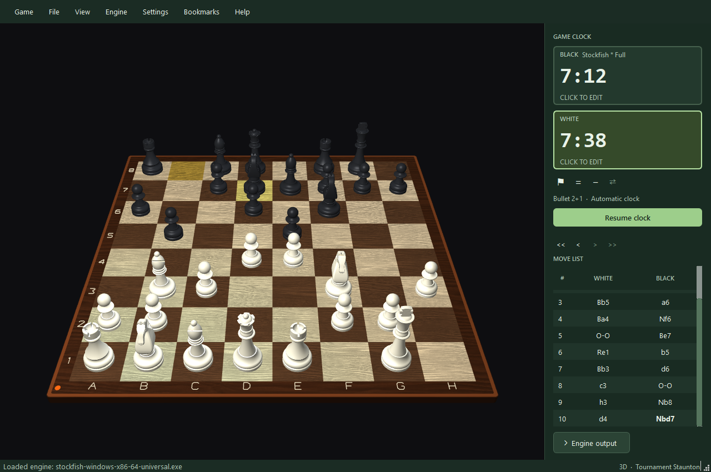
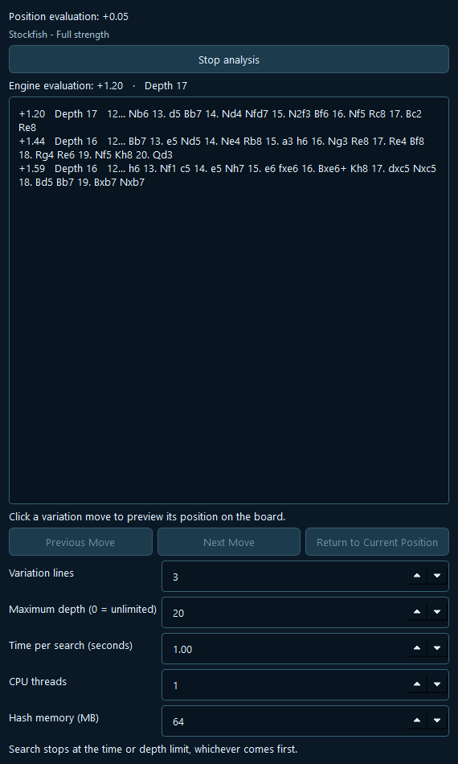
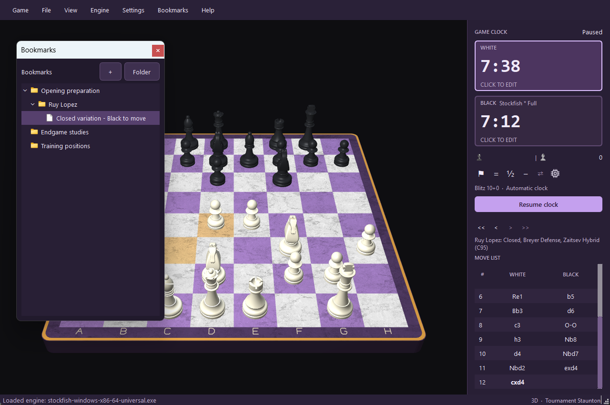
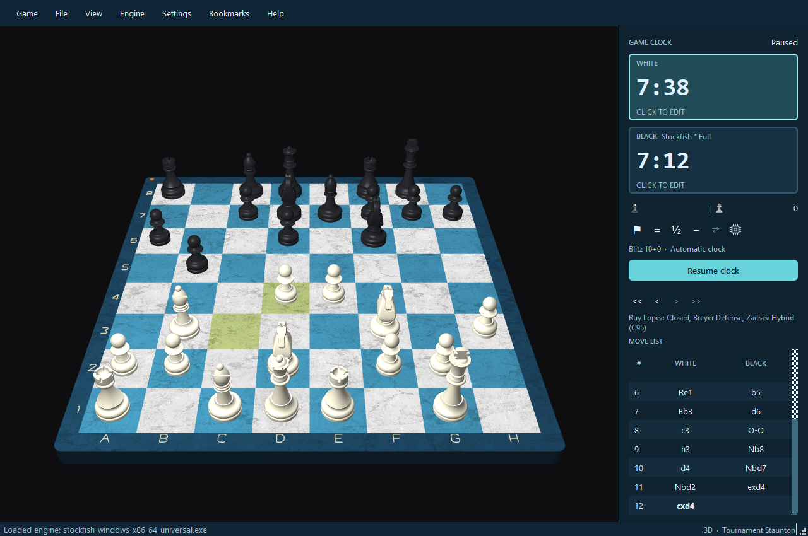
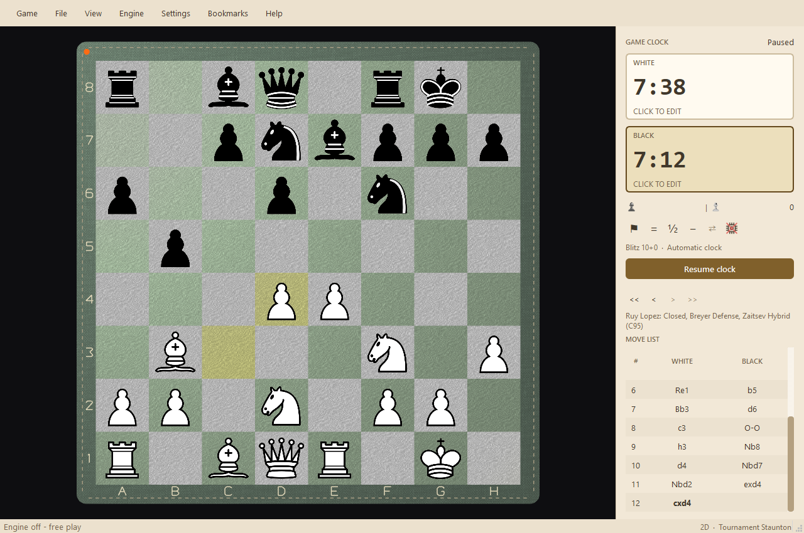

# OTBMaster3D

A free and open-source Windows chess application focused on natural over-the-board play,
engine analysis and organized position study.

**Latest version: 1.6.0 | Windows | main: unreleased development changes**



## Source and official installer

**Source:** application source and build instructions are licensed under GPL-3.0-only
in [norKI79/OTBMaster3D](https://github.com/norKI79/OTBMaster3D). The repository is
currently private; public source downloads remain pending. Version 1.6.0 is the
latest tagged version. Current `main` includes later, unreleased changes.

**Official Windows installer:** the distribution channel has not yet been selected.
Local installer artifacts are not cleared for public distribution and do not
establish that current `main` has been packaged or tested on a clean Windows machine.
There are no licence keys, DRM, activation, application accounts or paid feature unlocks.
Recipients may modify and redistribute it, including without charge, under GPLv3.

## Play, analyse and organize

- Interactive 3D board and flat 2D view, with click/drag moves, rotation, zoom and pan.
- Automatic or over-the-board clocks, configurable time controls, takeback, resign,
  draw and switch sides with clocks paused.
- Stockfish analysis, Stockfish/Fairy-Stockfish practice levels and optional Rodent IV opponents.
- Hierarchical bookmarks for positions: nested folders, drag/drop ordering, a
  floating organizer and matching Bookmarks menu.
- PGN/FEN import and export, move review, static evaluation and session recovery.
- Offline opening recognition below the move navigation controls, with the opening
  name and ECO code following the displayed move history.
- Captured white pieces on the left and black pieces on the right, plus a compact
  engine icon beside Switch Sides that is crossed out when the engine is off.
- Board materials, 3D/2D piece sets, interface themes and eight sound profiles.
  Preferences and bookmark panel geometry are remembered.

| Stockfish analysis: Midnight Ocean | Bookmarks: Marble & Brass, Amethyst |
| --- | --- |
|  |  |

<details>
<summary>More board styles and themes</summary>





</details>

Screenshots show the current source version. See [capture details](docs/images/README.md)
for the board and theme combinations.

## Install on Windows

The official installer is not yet cleared for public distribution. Once approved,
download it from the announced release location, run Setup, and launch OTBMaster3D
from the Start menu. Python is not required for the installer. The existing packaging
workflow includes Stockfish 19, Fairy-Stockfish 14 and three opening books. See
[source preparation status](docs/releases/1.6.0-source.md) for the retained build's scope.
Fairy-Stockfish presets cover 500–1500; Stockfish presets cover 1600–2500 and full strength.
Unavailable levels are hidden from both difficulty selectors. No external model
files are required. See [engine setup](engines/README.md) for the available targets.

Optional Rodent IV personality opponents are built separately for the source
workspace with MinGW-w64: Tal, Kasparov, Morphy, Karpov, Petrosian and Default.
Personality and target Elo (800–2800, or full strength) are independent.
The frozen installer does not include Rodent; see [Rodent setup](engines/README.md#rodent-iv-personality-opponents).


Requirements: Windows 10 or later, x64-compatible hardware and an OpenGL 2.1-capable
graphics driver. Source builds require Python 3.13 (64-bit), including Tkinter.

Current installer configuration requires Microsoft Visual C++ x64 Redistributable 14.44.35211.0
or newer, installed separately from
[Microsoft](https://learn.microsoft.com/en-us/cpp/windows/latest-supported-vc-redist).
Setup checks this prerequisite and gives instructions if it is missing.

The pinned cozy-chess-py wheel requires Python 3.13. Disk and RAM minimums beyond
these requirements have not been measured. Engine ratings are approximate.

Installer signing is not configured. Windows SmartScreen may show an
unknown-publisher or reputation warning. Any future public installer should be
accompanied by its SHA-256; no publisher verification is claimed.

## Useful controls

| Action | Control |
| --- | --- |
| Move | Click source and destination, or drag a piece |
| Rotate 3D / zoom | Right-drag or Ctrl+left-drag / mouse wheel |
| Start or pause clocks | Ctrl+P |
| Press OTB clock | Space |
| Take back / switch sides | U / Game > Switch sides or the switch-arrows button |
| Enable or disable engine play | Microchip icon beside Switch Sides; crossed out means off |
| Flip board / reset view | Ctrl+F / Ctrl+R |
| Manage bookmarks | Ctrl+Shift+B |
| Sidebar / focus mode | Ctrl+B / Ctrl+Shift+F |
| Fullscreen | F11 |

## Run and build from source

Use **Python 3.13 (64-bit)** with Tkinter on Windows:

```powershell
py -3.13 -m venv .venv
.\.venv\Scripts\python.exe -m pip install -r requirements.txt
.\.venv\Scripts\python.exe tools/install_stockfish.py
.\.venv\Scripts\python.exe tools/install_fairy_stockfish.py
.\.venv\Scripts\python.exe main.py
```

Engine setup is optional when using an existing supported engine or playing without one.
See the [user guide](docs/user-guide.md), [installer build instructions](docs/windows-installer.md),
[bookmark guide](docs/bookmark-ui.md) and [contribution/testing instructions](CONTRIBUTING.md).

## Automated tests

```powershell
.\.venv\Scripts\python.exe -m pip check
.\.venv\Scripts\python.exe -m compileall -q main.py otb_chess otb_chess_core tests tools
.\.venv\Scripts\python.exe -m unittest discover -s tests -v
```

The complete suite needs a Windows desktop with OpenGL and Tk. See
[CONTRIBUTING.md](CONTRIBUTING.md) for the dedicated Python 3.13 test environment
and which tests require installed engines.
To compile an installer, follow [the Windows build procedure](docs/windows-installer.md).

## Licensing, source access and acknowledgements

Copyright (C) 2026 norKI79 for original project material. Application source is
licensed under **GPL-3.0-only**; see [LICENSE](LICENSE) and [COPYRIGHT.md](COPYRIGHT.md).
Third-party engines, libraries and artwork retain their own terms. See
[third-party licences](THIRD_PARTY_LICENSES.md) and [source access](SOURCE_ACCESS.md).
Complete licence texts are available offline in Help > Open Source Licences.

Every public installer must link to its exact application and dependency source
archives at no additional charge. See [SOURCE_ACCESS.md](SOURCE_ACCESS.md) for the
installed source snapshot, build manifest and remaining dependency source gaps.
A repository homepage alone is not the matching source distribution.

## Bugs, contributions and maintenance

Report reproducible bugs in [GitHub issues](https://github.com/norKI79/OTBMaster3D/issues),
including version, Windows version, steps and a sanitised PGN/FEN when useful.
Use [SECURITY.md](SECURITY.md) for private security reports. Read
[CONTRIBUTING.md](CONTRIBUTING.md) and [CODE_OF_CONDUCT.md](CODE_OF_CONDUCT.md) before contributing.

OTBMaster3D is intended as a substantially finished application. Future features,
updates and technical support are not guaranteed, including with a purchase.
See [the maintenance policy](docs/MAINTENANCE.md). [Changelog](CHANGELOG.md).
