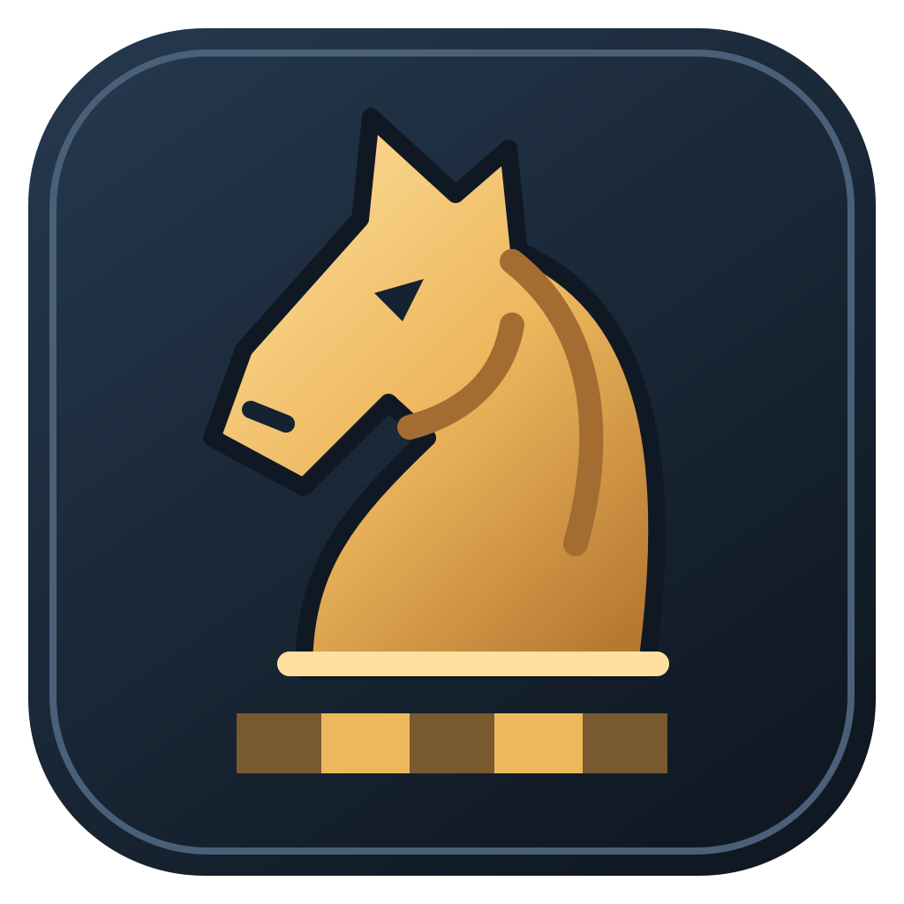

# OTBMaster3D

**1.2.0 Beta 1** ? a free, open-source desktop chess app for Windows, with a
3D tournament board, a flat 2D view, Stockfish support and over-the-board clocks.
Application source is licensed under **GPL-3.0-or-later**; see [LICENSE](LICENSE).
Third-party assets and dependencies retain their own licences.



This is beta release 1.2, tagged `v1.2.0-beta.1`. Earlier 7.x/8.x
versions were development milestones; their tags and history are preserved.
The GitHub beta is a **source release**. A Windows installer can also be built
locally; see [installer instructions](docs/windows-installer.md). See the
[beta release notes](docs/releases/1.2.0-beta.1.md) for the published source release.

## Features

- Difficulty presets automatically choose Maia or Stockfish, with saved custom settings.
- Setup Position offers live FEN editing, Textbook pieces, and click-to-pick-up/drop placement.
- A clickable static evaluation graph lets you review positions across a game.
- Eight selectable sound profiles, including a No sounds option.

- The board fills the main area; a resizable sidebar keeps the clocks and moves visible.
- Large clock cards show the active player and can be pressed in OTB mode.
- Game, View, Engine and Settings menus keep occasional controls out of the way.
- Engine output collapses below the move table; it shows evaluation, depth and the best line.
- Focus mode keeps just the board and clocks. The sidebar can also be hidden entirely.
- Window size, sidebar width, Focus mode and engine-panel visibility are remembered.
- Twelve interface themes, including Forest, Midnight Ocean, Ember and Warm Paper.
- New-game clocks wait for the first move; paused clocks can be adjusted independently.

See [CHANGELOG.md](CHANGELOG.md) for release history.

Public beta versions use `MAJOR.MINOR.PATCH-beta.N`.

## Run on Windows

Install Python 3.13 (64-bit) with Tkinter support and use a graphics driver that supports
OpenGL 2.1. From the project folder:

```powershell
py -3.13 -m venv .venv
.\.venv\Scripts\python.exe -m pip install -r requirements.txt
.\.venv\Scripts\python.exe tools/install_stockfish.py
.\.venv\Scripts\python.exe tools/install_maia.py
.\.venv\Scripts\python.exe main.py
```

Python 3.13 is the active supported runtime and chess-migration target. If your
existing `.venv` uses 3.14, create a fresh 3.13 environment rather than reusing it
(use another directory name to retain the old environment). Dependency pins are
unchanged. See the [3.13 compatibility results](docs/python-313-compatibility.md);
historical 3.14 test results remain recorded in the backend audit.

This is a source release; a standalone Windows installer is not included.
The app opens one window. The optional Stockfish setup downloads the official
Windows x64 release, verifies its SHA-256 hash, and preserves its source and licence.
The optional Maia setup installs the CPU runtime and six human-move models for difficulty presets.
Skip engine setup commands to use your own UCI engine or play without an engine.

## Board and pieces

**Settings → Board Type** offers Classic, Polished Marble, Rounded Oak,
Tournament Wood, Canvas Roll-up and Marble & Brass. These use distinct board
profiles and bundled ambientCG CC0 material maps. They switch immediately and
the choice is remembered. Textures also appear in 2D.

**Settings → Board Color Theme** controls square/frame colours independently
of board type. Marble veining, wood grain and fabric weave are tinted by those
colours. See [board material sources and licences](assets/boards/README.md).

Use **View ? 3D board / 2D board** to change views instantly.
The 2D board initially fits the window and supports clicking, dragging and flipping.
Scroll up to zoom in or down to zoom out in either view. Left-drag an empty area
to reposition the board. Each view remembers its own zoom and pan; Reset View
restores the current view's defaults without changing the game.
Switching back restores your 3D camera. View, piece set and appearance preferences
are saved locally in `config.json`.

**View → 3D piece set** changes the 3D pieces immediately:

| Set | Appearance |
| --- | --- |
| Tournament Staunton | Sourced 3D Staunton models in satin ivory and black; the default. |
| Wooden Staunton | The same models in boxwood and rosewood colours. |
| Classic Club | Procedural pieces with traditional silhouettes. |
| Sci-fi Vehicles | Drummyfish's CC0 tanks, vehicles and towers. |

**View → 2D piece set** independently selects Classic, Textbook (Cburnett),
Chessnut, Firi, Fantasy, Celtic, Spatial, Skulls or Eyes. Textbook provides
traditional black-and-white diagram pieces. Classic matches the 3D set's
colours. Both choices are remembered; see assets/pieces_2d for artwork credits.
Light/dark squares, frame colour, background colour and background images are
shared between views. Board presets include Wood, Tournament Green, Blue and Grey.
The previous Original option has been removed; saved selections migrate automatically.

## Controls

Sessions are recovered automatically on reopening, including the full game or
loaded position, move-review position and remaining clock times. Clocks always
restore paused. Moves and menu actions are saved immediately, clocks are
checkpointed every second, and quitting saves once more. Atomic local snapshots
and a previous-save backup protect against interrupted writes. A crash can lose
up to about one second of clock time. Use New game or Reset board to start fresh.
Session files live beside config.json and are excluded from Git.

**Settings → Piece movement speed** adjusts animation from Instant (the default)
to 1.5 seconds per move in both 2D and 3D. The choice is saved; game clocks and
move timing remain unchanged.

| Action | Control |
| --- | --- |
| Move a piece | Click source then destination, or drag and drop. |
| Promote a pawn | Choose Queen, Rook, Bishop or Knight. Cancel leaves the pawn in place. |
| Rotate the 3D board | Right-drag or Ctrl + left-drag. |
| Pan the board (2D or 3D) | Left-drag an empty area; dragging a movable piece moves that piece. |
| Zoom the board (2D or 3D) | Mouse wheel up to zoom in; down to zoom out. |
| Flip the board | View ? Flip board or Ctrl + F. |
| Take back a move | Game ? Take back or U. |
| Restore the view | View ? Reset view or Ctrl + R; the chess position is preserved. |
| Show/hide sidebar | View ? Show sidebar or Ctrl + B. |
| Focus mode | View ? Focus mode or Ctrl + Shift + F. |
| Fullscreen | F11; Escape leaves fullscreen. |
| Start/pause | Sidebar button or Ctrl + P. |
| Close the app | Game ? Quit or Ctrl + Q. |

## Engines and opening books

Open **Engine ? Engine and opening book**. Choose a compatible Windows UCI engine
from `engines/` or browse for one, choose its side, and Save. Loading runs in the
background. Leave the engine path empty to unload it. Engine side and opening
book selections apply to the next game.

The setup command installs Stockfish 19 for Windows x64 under `engines/stockfish-19/`, with its
source and GPLv3 licence. It loads automatically on first use and plays Black;
subsequent launches load the previously selected engine. An explicit unload is remembered.
Choose a Polyglot `.bin` book from the dropdown or browse for one. Three bundled
books use Lichess's CC0 opening data: all openings (default), 1.e4, and 1.d4.
These are repertoire collections, with weights based on the number of named
lines, not game-result statistics. See [book provenance](books/README.md).

The engine dialog offers **Full strength** or an approximate Elo target within
the loaded engine's supported range (1320–3190 for this Stockfish build).
**Balanced** uses the engine's chosen move. **Active** favours checks and captures;
**Quiet** favours other moves among candidates evaluated within 0.35 pawns of
the original choice. These app-level preferences require MultiPV support, use
extra search time, and can affect the effective rating. Book moves bypass strength
and style controls; select an empty book entry to use the engine on every move.
Strength and style are remembered and apply to subsequent engine searches.

Analysis starts automatically when an engine loads; **Engine ? Analyse position**
can pause or resume it. The expandable
Engine output panel shows the evaluation from White's perspective, depth and a
SAN best line. Completed engine-move searches are labelled **Last search** so they
are not mistaken for analysis of the current position. Analysis yields to engine
moves and ignores results belonging to an older position.

**Start analysis / Stop analysis** in Engine Output also controls line calculation.
Stopping analysis lets the current short search finish and leaves engine moves enabled.
The separate **Position evaluation** sits inside Engine Output and hides when it is collapsed
unless **Engine → Always show static evaluation** is enabled, which moves it beside
the **MOVE LIST** heading. This preference is remembered. The evaluation
updates immediately for moves, imports and history navigation. It estimates
material, piece placement and pawn structure without searching moves or using
Stockfish; tactical engine evaluations can differ. Both scores use pawn units,
with positive values favouring White and negative values favouring Black.

## Clocks

Use **File** to open PGN games or FEN positions, save PGN/FEN, copy either format,
or paste a FEN. Multi-game PGNs offer a game chooser. Imports leave clocks stopped.
Unchanged imported PGNs retain headers, comments and variations when saved;
the move list displays the main line. PGN saves the full game, while FEN saves
the position currently displayed.

When clocks are paused or inactive, click a move to view its position. Browsing
preserves the full game and does not change the clocks. Use **Game → Go to starting
position** or **Return to latest move** to navigate. Resuming an active game's clock
returns to its latest position automatically. Earlier positions are read-only.

Open **Settings ? Time control and clock** to choose a preset from hyperbullet
through classical, or a custom initial time and increment in seconds. Saved
settings update idle clocks immediately. During a game (including while paused),
settings apply to the next game; Reset clock applies the selected time control.

- **Online** clock mode switches clocks automatically after moves. This name
  describes clock behaviour; the app does not provide online multiplayer.
- **OTB** mode requires the human player to move and then press the configured
  clock input: Spacebar, Right Mouse, middle mouse, Mouse Button 4 or Mouse Button 5.
  With Right Mouse selected, use Ctrl+left-drag to rotate the 3D board.
- Clicking the active clock card also completes the turn in OTB mode.
- While paused, click either clock to adjust its minutes and seconds. Save changes
  only that clock and leaves the game paused; Cancel keeps its previous time.
- Engine moves complete their clock action automatically.
- The sidebar Start/Pause button controls play; Game ? Reset clock resets the timers.
- Colours, board themes, backgrounds and sound are in Settings.
- **Settings → Interface theme** switches instantly between Light, Dark, Blue,
  Cyberpunk, Pink/Lollipop, Forest, Midnight Ocean, Amethyst, Ember, Nordic Frost,
  Warm Paper and High Contrast. Your choice is remembered independently of board colours.
- Colour dialogs preview changes live on the board. Cancel restores the original
  colour and keeps any background image; OK saves the new colour.

`config.json` stores preferences, while `session.json` stores automatic game
recovery. PGN/FEN import and export are supported; a built-in saved-game library
is not yet implemented.

## Tests

The Windows CI workflow runs on pushes, pull requests, and manual dispatches.
It uses Python 3.13, installs the pinned dependencies, checks Python syntax, and
runs backend, notation, and asset tests without a graphics context. Native
Qt/GLFW rendering tests remain part of the local full-suite command below.

```powershell
.\.venv\Scripts\python.exe -m unittest discover -s tests -v
```

The tests cover assets, complete-set loading, view switching, persistence,
2D input, zoom/pan, native Qt menus and layout, clock dialogs, clickable OTB clocks,
and UCI play/analysis through a deterministic subprocess fixture. Rendering tests
use invisible native OpenGL surfaces and require a working graphics environment.
The older renderer regression tests use GLFW/Tk; the normal app launch uses Qt.
Tests never write to the user's configuration.

## Code structure

Chess-library integration is isolated in `otb_chess/chess_backend/`. See the
[staged replacement plan](docs/chess-backend-migration.md). Python-chess remains
a runtime dependency; the integration boundary does not change its licence.

`main.py` is only the launch entry point. The UI imports the controller directly;
application modules never import the launcher.

```text
main.py                 # Launch with python main.py
otb_chess/
    __main__.py         # Or python -m otb_chess
    version.py
    core/               # Game state, clocks, input and appearance controls
    graphics/           # Board rendering and 2D/3D pieces
    ui/                 # Desktop window, themes and legacy UI
    services/           # Settings, engines and audio
assets/                 # Bundled piece models and licences
tests/                  # Regression tests and UCI fixture
tools/                  # Asset conversion utilities
```

Source runs store settings and recovery files in the project folder. Frozen builds
use `%LOCALAPPDATA%/OTBMaster3D` for user data; engines and books live beside the
application. Both launch commands work from the project folder.

| Module | Responsibility |
| --- | --- |
| `otb_chess/ui/desktop_ui.py` | Qt window, widgets, menus, dialogs and event loop |
| `otb_chess/core/game.py` | `Chess3D` controller, game state, legal moves and game lifecycle |
| `otb_chess/core/clocks.py` | Timing, increments, pauses and manual clock presses |
| `otb_chess/services/engine.py` | UCI process lifecycle and background move requests |
| `otb_chess/graphics/rendering.py` | Board drawing, camera projection and picking |
| `otb_chess/core/board_input.py` | Pointer gestures, camera movement and GLFW callbacks |
| `otb_chess/core/appearance.py` | Board appearance, texture lifecycle and preference persistence |
| `otb_chess/graphics/gl_primitives.py` | OpenGL setup, geometry, materials and coordinate glyphs |
| `otb_chess/services/settings.py` | Paths, defaults, time controls and configuration storage |
| `otb_chess/services/audio.py` | Sound generation and playback |
| `otb_chess/ui/legacy_ui.py` | Previous Tk host, retained for regression coverage |
| `otb_chess/graphics/piece_sets.py`, `otb_chess/graphics/board_2d.py` | 3D models and flat piece rendering |
| `otb_chess/ui/interface_themes.py` | Qt interface palettes |

`Chess3D` owns the shared mutable game state. Its focused behaviour classes are
mixins, not independent copies of that state. The Qt `DesktopGame` subclass
supplies UI-specific hooks. Rendering methods require a current OpenGL context;
engine workers publish results for the UI thread to apply. Settings and audio
do not depend on the controller or UI. Keep new features in the module that owns
their responsibility rather than adding application logic to `main.py`.

## Assets and licences

**Help → Open Source Licences** shows the component inventory and local notice
paths. See [THIRD_PARTY_NOTICES.md](THIRD_PARTY_NOTICES.md), the machine-readable
[BOM](third_party_bom.json), and [Windows distribution preparation](docs/windows-commercial-distribution.md).
This beta is free and open source under GPL-3.0-or-later. Installer packaging
remains in development and is not part of this source release. Historical
proprietary-distribution research is retained for reference, not as the current
release plan. See [CONTRIBUTING.md](CONTRIBUTING.md) for development and reporting.

The bundled Staunton meshes are by
[clarkerubber](https://github.com/clarkerubber/Staunton-Pieces), copyright 2014,
and distributed under the [MIT licence](assets/pieces/tournament/LICENSE).
See [asset documentation](assets/pieces/README.md) for provenance, conversion
instructions and the format for adding complete custom sets.

Dependency licences are separate from the model licence. In particular,
[python-chess](https://python-chess.readthedocs.io/en/latest/#license) is
GPLv3-or-later. The models' MIT licence is not a licence for the whole application;
redistribution must account for the applicable dependency obligations.
PySide6/Qt also have their own licences; see the installed packages and
[Qt for Python licensing](https://doc.qt.io/qtforpython-6/licenses.html).

Local configuration, saved games, build outputs, virtual environments and downloaded
engine binaries are excluded from Git. The three small CC0 opening books are tracked.
